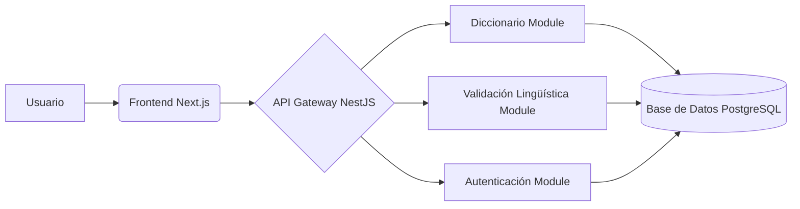

# Arquitectura del Sistema - Aplicación Kamëntsá

## 1. Diagrama de Componentes

```mermaid
graph TD
    A[Frontend Next.js] -->|API Calls| B[Backend NestJS];
    B --> C[(PostgreSQL)];
    C --> D[Diccionario Kamëntsá];
    B --> E[Auth Module];
    B --> F[Language Validation Module];
    B --> G[Cultural Content Module];
    B --> H[Gamification Module];
    B --> I[User Module];
    B --> J[Reward Module];
    B --> K[Progress Module];
    B --> L[Ranking Module];
    B --> M[Statistics Module];
    B --> N[Topic Module];
    B --> O[Lesson Module];
    B --> P[Module Module];
    B --> Q[Exercise Module];
    B --> R[Evaluation Module];
    B --> S[Content Module];
    B --> T[Content Versioning Module];
    B --> U[Content Validation Module];
    B --> V[Comments Module];
    B --> W[Activity Module];
    B --> X[Analytics Module];
    B --> Y[Auto Grading Module];
    B --> Z[Recommendations Module];
```



## 2. Flujo de Datos



## 3. Módulos Clave

-   `AuthModule`: Autenticación y autorización de usuarios.
-   `LanguageValidationModule`: Validación fonética y gramatical del idioma Kamëntsá.
-   `CulturalContentModule`: Gestión de contenido cultural y lingüístico.
-   `GamificationModule`: Implementación de mecánicas de juego para el aprendizaje, incluyendo:
    - Sistema de leaderboard (clasificaciones)
    - Logros culturales
    - Recompensas y badges
    - Progreso de usuarios
    - Misiones y desafíos

### Actualización Gamificación y Recompensas (Abril 2025)

- Se unificaron las entidades `Reward` en los módulos `gamification` y `reward` para evitar incompatibilidades de tipos.
- Se corrigieron las exportaciones de los enums `RewardType` y `RewardTrigger` para facilitar su uso en toda la aplicación.
- Se añadió el nuevo trigger `LESSON_COMPLETION` al enum `RewardTrigger` para soportar recompensas por finalización de lecciones.
- Se ajustaron las propiedades `criteria` y `rewardValue` para que sean opcionales y compatibles entre módulos.
- Se resolvieron errores de tipado en las pruebas unitarias relacionadas con recompensas y gamificación.

-   `UserModule`: Gestión de usuarios y perfiles.
-   `RewardModule`: Gestión de recompensas y logros.
-   `ProgressModule`: Seguimiento del progreso del usuario.
-   `RankingModule`: Gestión de rankings y clasificaciones.
-   `StatisticsModule`: Recopilación y visualización de estadísticas.
-   `TopicModule`: Gestión de temas y categorías.
-   `LessonModule`: Gestión de lecciones y cursos.
-   `ModuleModule`: Gestión de módulos y unidades.
-   `ExerciseModule`: Gestión de ejercicios y actividades.
-   `EvaluationModule`: Gestión de evaluaciones y exámenes.
-   `ContentModule`: Gestión de contenido multimedia.
-   `ContentVersioningModule`: Gestión de versiones de contenido.
-   `ContentValidationModule`: Validación de contenido.
-   `CommentsModule`: Gestión de comentarios y feedback.
-   `ActivityModule`: Registro de actividad del usuario.
-   `AnalyticsModule`: Recopilación y análisis de datos.
-   `AutoGradingModule`: Corrección automática de ejercicios.
-   `RecommendationsModule`: Recomendación de contenido personalizado.

## 4. Estándares Técnicos

-   API RESTful con versionado (/api/v1).
-   Autenticación JWT.
-   Documentación Swagger automática.
-   Uso de TypeORM para la gestión de la base de datos.
-   Implementación de pruebas unitarias y E2E (se han corregido errores en LeaderboardRepository).

## 5. Manejo de Caracteres Kamëntsá

```typescript
// Ejemplo de validación en DTO
export class CreateWordDto {
    @IsKamentsaText()
    readonly word: string;
}
```

## 6. Estructura de Directorios

```
src/
├── features/
│   ├── account/
│   ├── activity/
│   ├── analytics/
│   ├── auto-grading/
│   ├── comments/
│   ├── content/
│   ├── content-validation/
│   ├── content-versioning/
│   ├── cultural-content/
│   ├── evaluation/
│   ├── exercises/
│   ├── gamification/
│   ├── language-validation/
│   ├── lesson/
│   ├── module/
│   ├── notifications/
│   ├── progress/
│   ├── ranking/
│   ├── recommendations/
│   ├── reward/
│   ├── statistics/
│   ├── topic/
│   ├── unity/
│   └── user/
└── ...
