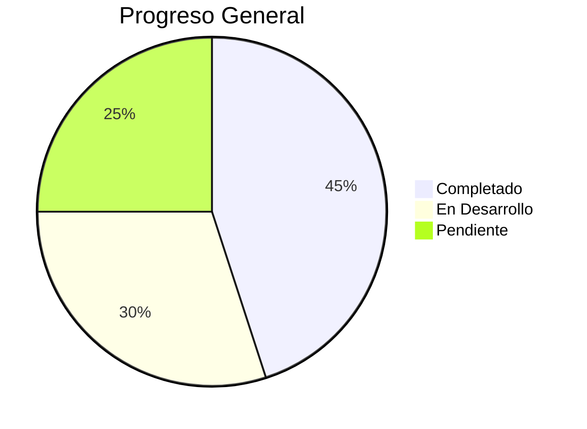

# Estado del Proyecto Kamëntsá

## 📌 Resumen Ejecutivo

Este documento describe el estado actual del proyecto de revitalización lingüística Kamëntsá, incluyendo el progreso realizado, los desafíos pendientes y la hoja de ruta futura.

## ✅ Progreso Realizado

### Backend (NestJS)

-   [x] Estructura modular implementada.
-   [x] Autenticación JWT básica funcional.
-   [x] Módulo de validación lingüística con soporte para caracteres especiales.
-   [x] Integración con PostgreSQL.
-   [x] Documentación Swagger generada automáticamente.
-   [ ] Documentación TSDoc completa para servicios críticos.
-   [ ] Ejemplos de uso con diacríticos en documentación.
-   [ ] Guías de estilo bilingües (Kamëntsá/español).
-   [ ] Documentación de validación fonética con ejemplos.
-   [ ] Glosario técnico bilingüe (Kamëntsá/español).
-   [ ] Plantillas para documentación de componentes.
-   [ ] Documentación de endpoints con ejemplos en Kamëntsá.
-   [ ] Glosario de términos técnicos bilingüe.
-   [ ] Ejemplos de uso con diacríticos en documentación Swagger.
-   [ ] Documentación de validación fonética con ejemplos prácticos.
-   [ ] Diagramas de arquitectura con notación cultural.
-   [x] Configuración inicial de CI/CD con GitHub Actions.
-   [x] Husky + lint-staged para pre-commit hooks.
-   [x] Validación de tipos y estilo en pipeline.
-   [ ] Auditoría de seguridad automatizada.
-   [ ] Blue-green deployment para backend.
-   [ ] ISR (Incremental Static Regeneration) para frontend.
-   [x] Pruebas unitarias básicas implementadas (Jest).
-   [x] Configuración inicial de pruebas E2E (Supertest).
-   [ ] Cobertura >80% en lógica crítica.
-   [ ] Pruebas de validación lingüística con diacríticos.
-   [ ] Mock completo de diccionario Kamëntsá para pruebas.
-   [ ] Pruebas de fonética con términos Kamëntsá.
-   [ ] Casos de prueba para caracteres especiales (ë, s̈, ts̈, ñ).
-   [ ] Pruebas de validación lingüística con términos del diccionario.
-   [ ] Pruebas de edge cases con combinaciones de diacríticos.
-   [ ] Pruebas de accesibilidad automatizadas.
-   [ ] Pruebas de carga con términos Kamëntsá.
-   [ ] Validación de fonética en pruebas unitarias.
-   [ ] Casos de prueba para caracteres especiales (ë, s̈, ts̈, ñ).
-   [ ] Mock completo de API para frontend.
-   [ ] Pruebas de interacción clave con Testing Library.
-   [x] Validación de tipos estricta (strict: true).
-   [x] Manejo estructurado de errores (HttpException).
-   [x] Configuración de TypeORM para entidades.

### Frontend (Next.js)

-   [x] Estructura de componentes reutilizables implementada.
-   [x] Soporte para UTF-8 y diacríticos Kamëntsá.
-   [x] Configuración inicial de ESLint y Prettier.
-   [x] Integración básica de i18n.
-   [x] Configuración de alias @/ en tsconfig.
-   [x] Implementación inicial de eslint-plugin-jsx-a11y.
-   [x] Contraste mínimo 4.5:1 para texto principal.
-   [x] Atributos ARIA básicos implementados.
-   [ ] Etiquetas en Kamëntsá y español para todos los componentes.
-   [ ] Soporte completo para lectores de pantalla.
-   [ ] Pruebas automatizadas de accesibilidad (axe-core).
-   [ ] Validación de contraste para todos los modos de color.
-   [ ] Textos alternativos para iconografía cultural.
-   [ ] Validación de lectores de pantalla con términos Kamëntsá.
-   [ ] Pruebas de navegación con solo teclado.
-   [ ] Pruebas de contraste con textos Kamëntsá.
-   [ ] Validación de ARIA labels en componentes interactivos.
-   [ ] Documentación de accesibilidad bilingüe.
-   [ ] Diseño responsivo adaptable a diferentes dispositivos (en progreso).
-   [ ] Navegación por teclado 100% funcional.
-   [ ] Iconografía culturalmente apropiada.
-   [ ] Validación con eslint-plugin-jsx-a11y en todos los componentes.
-   [ ] Pruebas de accesibilidad con lectores de pantalla (NVDA, VoiceOver).
-   [ ] Validación de contraste para textos con diacríticos Kamëntsá.
-   [ ] Pruebas de navegación con teclado en formularios interactivos.

## 🚧 En Desarrollo

### Backend

-   [ ] Implementación completa de pruebas unitarias y E2E.
-   [ ] Integración con el diccionario consolidado para la validación lingüística.
-   [ ] Implementación de la lógica de gamificación.
-   [ ] Desarrollo de la API para la gestión de contenido cultural.

### Frontend

-   [ ] Implementación de la navegación por teclado.
-   [ ] Mejora de la accesibilidad (WCAG 2.1).
-   [ ] Implementación de la internacionalización (i18n) para Kamëntsá y español.

## 📅 Hoja de Ruta (Roadmap)

### Próximos Pasos (Q1 2025)

-   [ ] Finalizar la integración del diccionario Kamëntsá.
-   [ ] Implementar pruebas unitarias y E2E para los módulos principales.
-   [ ] Mejorar la accesibilidad del frontend.
-   [ ] Implementar la lógica básica de gamificación.

### Metas a Mediano Plazo (Q2-Q3 2025)

-   [ ] Desarrollar la API para la gestión de contenido cultural.
-   [ ] Implementar un sistema de aprendizaje adaptativo.
-   [ ] Crear contenido multimedia accesible.
-   [ ] Realizar una auditoría de accesibilidad WCAG 2.1.

### Visión a Largo Plazo (Q4 2025 y más allá)

-   [ ] Expandir la plataforma con nuevas funcionalidades y contenido.
-   [ ] Establecer colaboraciones con la comunidad Kamëntsá.
-   [ ] Convertir la plataforma en un recurso de referencia para la lengua Kamëntsá.

## 🐛 Issues Conocidos

-   [ ] La validación lingüística no es precisa al 100% y requiere mejoras.
-   [ ] La documentación Swagger está incompleta y necesita ser revisada.
-   [ ] La accesibilidad del frontend necesita mejoras significativas (WCAG 2.1).
-   [ ] La lógica de gamificación no está implementada.
-   [ ] Pruebas E2E pendientes para módulos críticos.
-   [ ] Internacionalización completa (i18n) para Kamëntsá/español.
-   [ ] Optimización de rendimiento en componentes complejos.

## 📊 Estado Actual

**Última actualización**: 4-Ene-2025  
**Responsable**: Equipo de Desarrollo Kamëntsá
